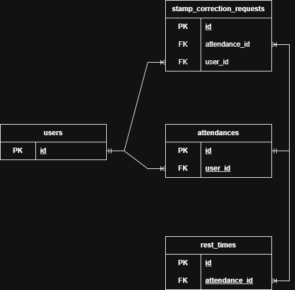

# coachtech 勤怠管理アプリ

## 使用技術

- PHP 8.1
- Laravel 10
- MySQL 8.0.26
- Docker
- Tailwind CSS

## 環境構築

### 1. リポジトリのクローン

```bash
git clone <リポジトリURL>
cd coachtech-attendance
```

### 2. Dockerコンテナのビルド・起動

```bash
docker compose up -d --build
```

### 3. 環境変数の設定

```bash
cp src/.env.example src/.env
```

### 4. Composerパッケージのインストール

```bash
docker compose exec php composer install
```

### 5. アプリケーションキーの生成

```bash
docker compose exec php php artisan key:generate
```

### 6. マイグレーションの実行

```bash
docker compose exec php php artisan migrate
```

### 7. シーディングの実行

```bash
docker compose exec php php artisan db:seed
```

## URL一覧

| サービス | URL |
|---|---|
| アプリケーション | http://localhost:8090 |
| phpMyAdmin | http://localhost:8091 |
| Mailhog | http://localhost:8026 |

## ログイン情報

| 役割 | メールアドレス | パスワード |
|---|---|---|
| 管理者 | admin@example.com | ysnb5884 |
| 一般ユーザー (taro) | taro@example.com | password1234 |
| 一般ユーザー (jiro) | jiro@example.com | password5678 |

## ER図


